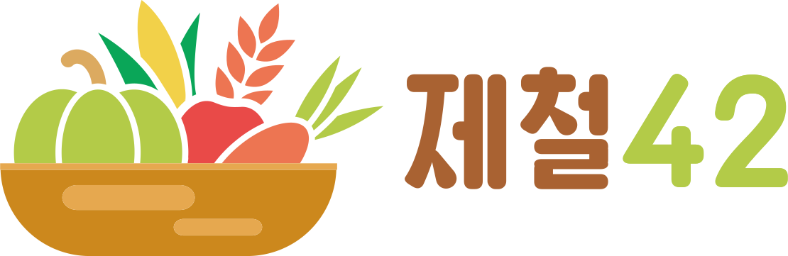

# FRONT-END

### 1~2인 소가구를 대상으로 제철 수확물에 대한 정보를 제공하고, 지역 공동체 활성화를 추구하는 커뮤니티형 웹 사이트

link: https://jecheol42.herokuapp.com/
  
 

### 개발 언어 및 프레임워크
-  &nbsp;  &nbsp; &nbsp;

### 배포 플랫폼
- 

### 협업 도구
-  &nbsp; &nbsp;

  
### 시연 영상
https://www.youtube.com/watch?v=hERhz800fU8
